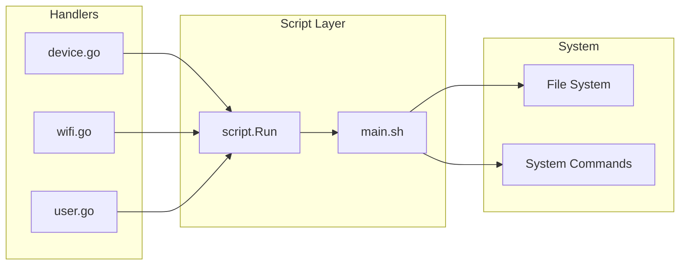
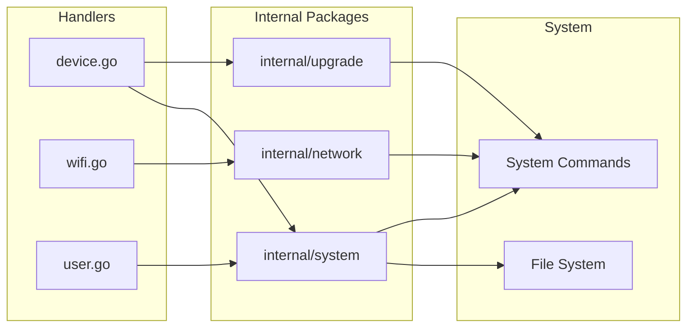

# Migration Plan: main.sh to Native Go

## Overview

Migrate all functionality from `solutions/supervisor/rootfs/usr/share/supervisor/scripts/main.sh` (652 lines of bash) to native Go code, eliminating the dependency on shell script execution.

## Current Architecture



## Target Architecture



## Package Structure

### 1. internal/system - System utilities

**File:** `internal/system/system.go`

Implements low-level system operations:
- Network interface info: IP, mask, MAC, gateway, DNS
- Device info: serial number, hostname, OS version
- File operations for /etc files
- Process management: stop processes by name

**Functions to implement:**
```go
// Network interface functions
func GetIP(ifname string) string
func GetMask(ifname string) string
func GetMAC(ifname string) string
func GetGateway(ifname string) string
func GetDNS() string
func GetDNS2() string

// Device functions
func GetSerialNumber() string
func GetDeviceName() string
func GetOSName() string
func GetOSVersion() string

// Process functions
func StopProcessByName(name string, signal int) error
```

### 2. internal/device - Device management

**File:** `internal/device/device.go`

Implements device-specific operations:
- Query device info (network, channel, etc.)
- Update device name with avahi restart
- Get device list via avahi-browse
- Model management

**Functions to implement:**
```go
type DeviceInfo struct {
    Channel     int    `json:"channel"`
    ServerURL   string `json:"serverUrl"`
    NeedRestart bool   `json:"needRestart"`
    EthIP       string `json:"ethIp"`
    WlanIP      string `json:"wlanIp"`
    Mask        string `json:"mask"`
    MAC         string `json:"macAddress"`
    Gateway     string `json:"gateway"`
    DNS         string `json:"dns"`
    DeviceName  string `json:"deviceName"`
}

func QueryDeviceInfo() (*DeviceInfo, error)
func UpdateDeviceName(name string) error
func GetDeviceList() ([]Device, error)
func GetAPIDevice() (*APIDeviceInfo, error)
```

### 3. internal/network - WiFi management

**File:** `internal/network/wifi.go`

Implements WiFi operations using wpa_cli and iw commands:

**Functions to implement:**
```go
type WiFiNetwork struct {
    ID       int    `json:"id"`
    SSID     string `json:"ssid"`
    BSSID    string `json:"bssid"`
    Flags    string `json:"flags"`
    Signal   int    `json:"signal"`
    Security string `json:"security"`
}

type WiFiStatus struct {
    SSID      string `json:"ssid"`
    BSSID     string `json:"bssid"`
    IP        string `json:"ip"`
    State     string `json:"state"`
    Connected bool   `json:"connected"`
}

type EthernetInfo struct {
    IP         string `json:"ip"`
    SubnetMask string `json:"subnetMask"`
    MACAddress string `json:"macAddress"`
    Gateway    string `json:"gateway"`
    DNS1       string `json:"dns1"`
    DNS2       string `json:"dns2"`
}

// WiFi control
func StartWiFi() (sta int, ap int, err error)
func StopWiFi() error
func SwitchWiFi(enable bool) error

// WiFi status
func GetStaCurrent() (*WiFiStatus, error)
func GetStaConnected() ([]WiFiNetwork, error)
func GetScanList() ([]WiFiNetwork, error)
func GetEthernet() (*EthernetInfo, error)

// WiFi connections
func ConnectWiFi(ssid, password string, id int) error
func DisconnectWiFi(ssid string) error
func ForgetWiFi(ssid string) error
```

**File:** `internal/network/wpa.go`

WPA supplicant wrapper:

```go
type WPAClient struct {
    interface string
}

func NewWPAClient(iface string) *WPAClient
func (w *WPAClient) Status() (map[string]string, error)
func (w *WPAClient) ListNetworks() ([]Network, error)
func (w *WPAClient) AddNetwork() (int, error)
func (w *WPAClient) SetNetwork(id int, key, value string) error
func (w *WPAClient) EnableNetwork(id int) error
func (w *WPAClient) DisableNetwork(id int) error
func (w *WPAClient) RemoveNetwork(id int) error
func (w *WPAClient) SelectNetwork(id int) error
func (w *WPAClient) Reconfigure() error
func (w *WPAClient) SaveConfig() error
func (w *WPAClient) Disconnect() error
```

### 4. internal/upgrade - System upgrade management

**File:** `internal/upgrade/upgrade.go`

Implements upgrade operations:
- Still uses upgrade.sh for complex operations
- But manages state and progress in Go

**Functions to implement:**
```go
type UpdateVersion struct {
    OSName    string `json:"osName"`
    OSVersion string `json:"osVersion"`
    Status    int    `json:"status"` // 1=available, 2=upgrading, 3=querying
}

type UpdateProgress struct {
    Progress int    `json:"progress"`
    Status   string `json:"status"` // download, upgrade, idle
}

func UpdateChannel(channel int, url string) error
func GetSystemUpdateVersion() (*UpdateVersion, error)
func GetUpdateProgress() (*UpdateProgress, error)
func UpdateSystem() error
func CancelUpdate() error
```

## Implementation Strategy

### Phase 1: Create internal packages with core utilities

1. Create `internal/system/system.go` with network interface functions
2. Create `internal/system/device.go` with device info functions
3. Add unit tests for system package

### Phase 2: Implement device functions

1. Implement `QueryDeviceInfo` using system package
2. Implement `UpdateDeviceName` with avahi restart
3. Implement `GetAPIDevice` for device capabilities
4. Refactor `device.go` handlers to use new package

### Phase 3: Implement network/WiFi functions

1. Create `internal/network/wpa.go` for wpa_cli wrapper
2. Create `internal/network/wifi.go` for WiFi management
3. Implement scan parsing for `iw dev wlan0 scan` output
4. Refactor `wifi.go` handlers to use new package

### Phase 4: Implement upgrade functions

1. Create `internal/upgrade/upgrade.go`
2. Implement channel management
3. Keep using upgrade.sh for actual upgrade operations
4. Refactor device.go update handlers

### Phase 5: Cleanup

1. Remove all `script.Run` calls from handlers
2. Deprecate `internal/script` package
3. Remove `main.sh` from rootfs
4. Update Makefile to not copy scripts
5. Full integration testing

## Key Implementation Notes

### Reading Network Interface Info

The shell script uses `ifconfig` and `route`. In Go, we can:
- Read from `/sys/class/net/` for interface info
- Use `net` package for IP addresses
- Parse `/proc/net/route` for gateway
- Parse `/etc/resolv.conf` for DNS

Example Go implementation:
```go
import (
    "net"
    "os"
    "strings"
)

func GetIP(ifname string) string {
    iface, err := net.InterfaceByName(ifname)
    if err != nil {
        return ""
    }
    addrs, err := iface.Addrs()
    if err != nil || len(addrs) == 0 {
        return ""
    }
    for _, addr := range addrs {
        if ipnet, ok := addr.(*net.IPNet); ok && ipnet.IP.To4() != nil {
            return ipnet.IP.String()
        }
    }
    return ""
}
```

### WPA CLI Wrapper

Execute wpa_cli commands and parse output:
```go
func (w *WPAClient) run(args ...string) (string, error) {
    cmd := exec.Command("wpa_cli", append([]string{"-i", w.iface}, args...)...)
    out, err := cmd.Output()
    return string(out), err
}
```

### Avahi Service Restart

```go
func restartAvahi() error {
    exec.Command("/etc/init.d/S50avahi-daemon", "stop").Run()
    time.Sleep(50 * time.Millisecond)
    return exec.Command("/etc/init.d/S50avahi-daemon", "start").Run()
}
```

## Testing Strategy

1. **Unit tests** for parsing functions (iw output, wpa_cli output)
2. **Integration tests** on actual device via SSH
3. **API tests** using curl or httpie against deployed supervisor

## Risk Mitigation

1. **Keep upgrade.sh** - The upgrade functionality is complex and involves bootloader operations. Keep using the shell script for actual upgrades.

2. **Incremental migration** - Migrate one handler at a time, test thoroughly before moving to the next.

3. **Fallback option** - Keep main.sh in the repo until all functionality is verified working.

## Files to Create

```
solutions/supervisor/
├── internal/
│   ├── system/
│   │   ├── system.go      # Network, device info utilities
│   │   └── system_test.go
│   ├── device/
│   │   ├── device.go      # Device management
│   │   └── device_test.go
│   ├── network/
│   │   ├── wifi.go        # WiFi management
│   │   ├── wpa.go         # WPA CLI wrapper
│   │   ├── wifi_test.go
│   │   └── wpa_test.go
│   └── upgrade/
│       ├── upgrade.go     # Upgrade management
│       └── upgrade_test.go
```

## Files to Modify

1. `internal/handler/device.go` - Remove script.Run calls
2. `internal/handler/wifi.go` - Remove script.Run calls
3. `internal/handler/user.go` - Remove script.Run calls (minimal)
4. `Makefile` - Remove scripts copy step

## Files to Delete

1. `rootfs/usr/share/supervisor/scripts/main.sh`
2. `internal/script/script.go` (after migration complete)
