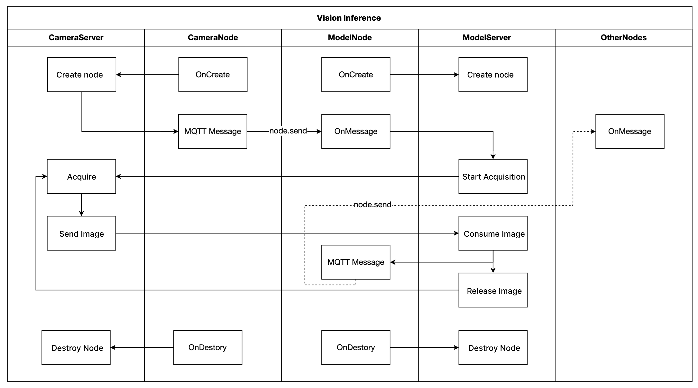

# SSCMA Node Service

## Overview

The **SSCMA Node** service is a pre-installed system service within **ReCameraOS** designed to provide a backend service for Node-RED to perform model operations. This service integrates with Node-RED through the `node-red-contrib-sscma` package. Communication between the SSCMA Node service and Node-RED is facilitated via MQTT, but users can also interact with the service directly through the protocol without using Node-RED.

For details on the protocol, refer to the [SSCMA Node Protocol Documentation](../../docs/sscma-node-protocol.md). Additionally, a simple Python script for testing communication via MQTT is provided in the `test/test_node.py` directory. Please note that this script is intended for basic testing and has not undergone extensive validation.

## Getting Started

Before building this solution, ensure that you have set up the **ReCameraOS** environment as described in the main project documentation:

🔗 **[SSCMA Example for SG200X - Main README](../../README.md)**

This includes:

- Setting up **ReCameraOS**
- Configuring the SDK path
- Preparing the necessary toolchain

If you haven't completed these steps, follow the instructions in the main project README before proceeding.

## Building & Installing

### 1. Navigate to the `sscma-node` Service Directory

```bash
cd solutions/sscma-node
```

### 2. Build the Application

```bash
mkdir build
cd build
cmake ..
make
```

### 3. Run the Application

To run the application, use the following command:

```bash
sudo ./sscma-node --start
```

<a href="url"></a>


## Available Nodes and Functionalities


1. **Camera Node**
   - **Functionality**: Allows users to create, manage, and control camera instances. This node can handle video capture and processing tasks.
   - **Operations**:
     - Create a camera instance with specific configurations (e.g., resolution, frame rate).
     - Destroy the camera instance when it is no longer needed.
     - Enable or disable the camera for operation.

2. **Model Node**
   - **Functionality**: Manages machine learning model instances for inference tasks. This node can be used to process input data and return results.
   - **Operations**:
     - Create a model instance with parameters such as model path and thresholds for processing.
     - Destroy the model instance when it is no longer needed.
     - Control the model configuration to adjust processing parameters.

3. **Streaming Node**
   - **Functionality**: Facilitates video streaming from camera instances. This node can handle streaming protocols and configurations for real-time video output.
   - **Operations**:
     - Create a streaming instance with specified protocol and port settings.
     - Destroy the streaming instance when it is no longer needed.
     - Enable or disable streaming functionality.

4. **Saving Node**
   - **Functionality**: Manages saving video and data to local or external storage. This node allows users to configure storage parameters for recording.
   - **Operations**:
     - Create a saving instance with options for storage type and duration.
     - Destroy the saving instance when it is no longer needed.
     - Enable or disable saving functionality.


If you are not familiar with Node-Red, you can watch this [tutorial](https://www.youtube.com/watch?v=DFNv91TTt68) to learn how to use nodes to achieve different functions and building UI.


## Conclusion

The SSCMA Node service provides essential functionalities for managing camera, model, streaming, and saving operations within the SSCMA system. Users can integrate these nodes with Node-RED or communicate directly with the service to perform various tasks in their applications.

For further information on each node and its operations, refer to the respective documentation within the SSCMA framework.

