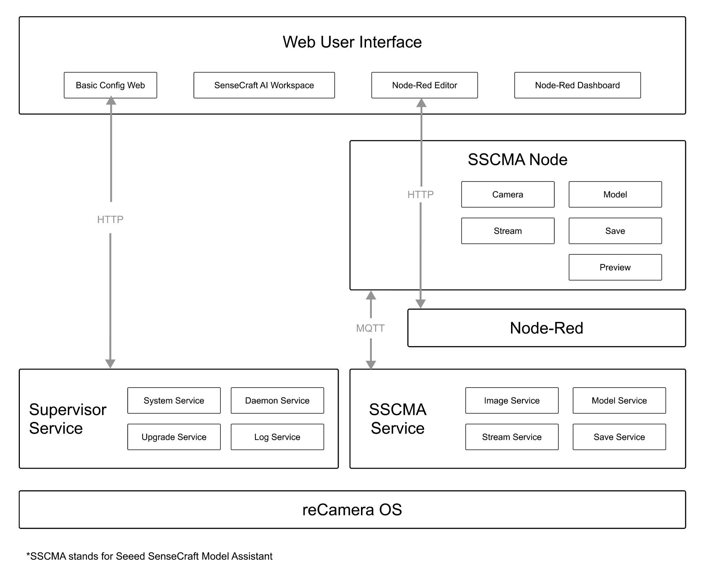

# Supervisor Solution  

## Overview  

**Supervisor** is a built-in service for **ReCamera-OS** that provides:  

- An **HTTP service** for remote communication.  
- A **Web UI** for device management and monitoring.  
- **System status monitoring** to ensure stable device operation.  




The foundational system service providing:
- System Services:
    - Device management: Identify and configure connected devices, storage devices, etc.
    - User Management: Manage user accounts, credentials, and SSH keys.
    - Network configuration: Configure wired and wireless network connections.
    - File system operations: Manage device files.
    - Device Discovery: Uses mDNS to broadcast device information. The device hostname is recamera.local.When a web interface sends a request, the recamera device scans the local network for other recamera devices via mDNS, generates a list of discovered devices, formats the data, and returns it to the web interface. (Note: Currently, only one device’s information is returned.)

- Update Service:
    - Package/firmware download management
    - Security verification
    - Installation automation

- Daemon Service:
    - System health monitoring
    - Automatic application recovery

- Logging Service:
    - Runtime status tracking
    - Error diagnostics

- Application Service:
    - Application Deployment
    - Application Packaging


## Getting Started  

Before building this solution, ensure that you have set up the **ReCamera-OS** environment as described in the main project documentation:  

🔗 **[SSCMA Example for SG200X - Main README](../../README.md)**  

This includes:  

- Setting up **ReCamera-OS**  
- Configuring the SDK path  
- Preparing the necessary toolchain  

If you haven't completed these steps, follow the instructions in the main project README before proceeding.

## Building & Installing  

### 1. Navigate to the `supervisor` Solution  

```bash
cd solutions/supervisor
```

### 2. Build the Application  

By default, the application is built **without** the Web UI.  

```bash
cmake -B build -DCMAKE_BUILD_TYPE=Release .
cmake --build build
```

#### ⚙️ Enabling Web UI  

If you want to include the Web UI, enable the `WEB` option before building. This will:  

1. Recompile the front-end project in `www/`.  
2. Copy the output to `rootfs/usr/share/supervisor/www/`.  

To enable Web UI:  

```bash
cmake -B build -DCMAKE_BUILD_TYPE=Release -DWEB=ON .
cmake --build build
```

**Note:** The Web UI build process requires **Node.js** to be installed.

### 3. Package the Application  

```bash
cd build && cpack
```

This will generate an `.ipk` package for installation.

## Deploying & Running  

### 1. Transfer the Package to Your Device  

Copy the package to the ReCamera device using `scp`:  

```bash
scp build/supervisor-1.0.0-1.ipk recamera@192.168.42.1:/tmp/
```

Replace `recamera@192.168.42.1` with your device's IP address.

### 2. Install the Package  

SSH into the device and install the package:  

```bash
ssh recamera@192.168.42.1
sudo opkg install /tmp/supervisor-1.0.0-1.ipk
```

### 3. Run the Supervisor Service  

Once installed, start the service:  

```bash
sudo supervisor
```

If running correctly, the HTTP server should be accessible.

### 4. Access the Web UI  

If built with Web UI enabled, open a browser and visit:  

```
http://<device-ip>:<port>
```

Replace `<device-ip>` with the actual IP of your ReCamera device.

## Disabling the Supervisor Service  

If you want to **disable** the `supervisor` service from running automatically on startup, remove or move the init script:  

```bash
mv /etc/init.d/S93sscma-supervisor /etc/init.d/S93sscma-supervisor.bak
```

To **reenable** it, move it back:  

```bash
mv /etc/init.d/S93sscma-supervisor.bak /etc/init.d/S93sscma-supervisor
```

## Directory Structure  

```
supervisor/
├── CMakeLists.txt    # CMake build configuration
├── control           # OPKG packaging script
├── main              # Source code directory
├── README.md         # This README file
├── rootfs            # Resource files (installed to system root)
│   └── usr/share/supervisor/www  # Web UI files (if enabled)
└── www               # Web UI source code (requires Node.js)
```